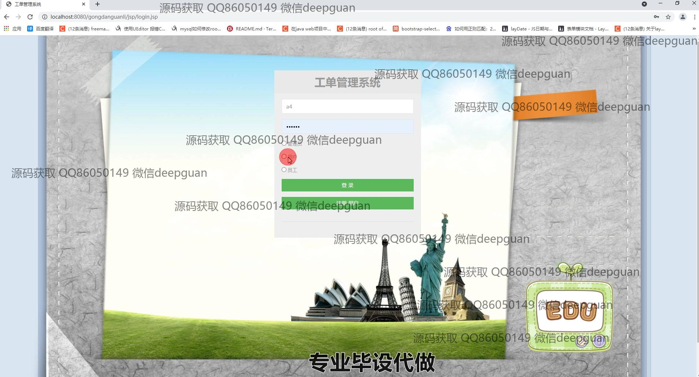

<h1 align="center">工单管理系统的设计与实现</h1>

## 简介
工单管理系统：角色分为管理员、用户、员工；功能包括用户管理、工单管理、公告管理、热门问题管理，支持工单查询、编辑、删除与沟通功能，提高工作效率。    --计算机毕业设计源码；毕设源码；java毕业设计源码

## 联系方式

<h3 align="center">获取完整代码与数据库文件 + 微信：deepguan QQ: 86050149 QQ群: 783742310</h3>

<h3 align="center">可帮忙远程部署 包运行成功！提供远程部署、修改代码、设计文档指导、代码讲解等服务！</h3>

## 功能介绍（完整见运行截图）
管理员：管理员能够通过登录和注册进入系统，访问主页，利用导航栏管理用户、工单和公告，同时维护热点问题类型。系统提供了全面的公告和用户管理功能，支持添加、查看、修改、以及批量删除操作。管理员可处理工单，进行工单状态更新和流程管理，确保高效的任务分配和跟踪。工单的审核、查看和工单沟通内容管理也在管理员职责之内，管理员还能进行数据的统计分析以支持决策。

用户：用户通过注册和登录功能进入系统，可以在个人中心管理自己的基本信息和查看个人工单记录。用户可以通过工单管理界面提交工单，查看工单状态，添加评论和附件文件。用户还可在公告管理模块中浏览发布的信息并查看详细公告内容。此外，系统提供了便捷的工单沟通界面，用户能够与管理员或其他相关人员进行交流，并编辑和上传沟通内容，提高工单处理效率。

## 运行截图

本代码来源于网络,仅供学习参考使用!

